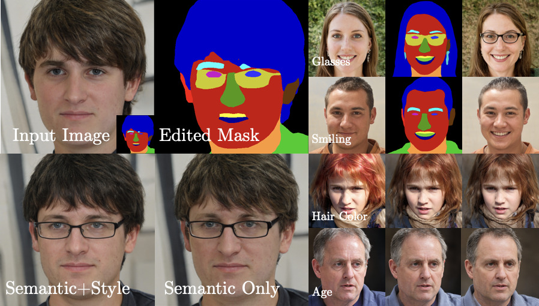

# S2-Flow: Joint Semantic and Style Editing of Facial Images
[](https://opensource.org/licenses/Apache-2.0)
[](https://pytorch.org/)

This is the official repository accompanying the BMVC 2022 paper:

[K. Singh](https://kris-singh.github.io/), [S. Schaub-Meyer](https://schaubsi.github.io/), and [S. Roth](https://www.visinf.tu-darmstadt.de/visinf/team_members/sroth/sroth.en.jsp). 

# Abstract
<p align="center" width="100%">

</p>

**Figure:** S2-Flow is capable of applying semantic (top right), style (bottom right), and joint semantic and style edits (left) for facial images while preserving both identity and realism.

The high-quality images yielded by generative adversarial networks (GANs) have motivated investigations into their application for image editing. However, GANs are often limited in the control they provide for performing specific edits. One of the principal challenges is the entangled latent space of GANs, which is not directly suitable for performing independent and detailed edits. Recent editing methods allow for either controlled style edits or controlled semantic edits. In addition, methods that use semantic masks to edit images have difficulty preserving the identity and are unable to perform controlled style edits.
We propose a method to disentangle a GAN’s latent space into semantic and style spaces, enabling controlled semantic and style edits for face images independently within the same framework. To achieve this, we design an encoder-decoder based network architecture (S2-Flow), which incorporates two proposed inductive biases. We show the suitability of S2-Flow quantitatively and qualitatively by performing various semantic and style edits. 

[[Paper]()]


# Installation

Clone this repo.
```bash
git clone https://github.com/visinf/s2-flow.git
cd s2-flow/
```

This code requires PyTorch, TensorFlow, Torchdiffeq, and Python 3+. Please install dependencies by
```bash
conda env create --file environment.yaml
python setup.py install
```
After this, go to this [google drive](https://drive.google.com/drive/folders/1nZ_U0qCFFwBM9L_h9mmV9W0axFt4Xd-N?usp=sharing), and 
* Download `experiments` and place them under `./`. 
* Download and unzip `data.zip` and place it under `./`.
* Download and unzip `deeplab_model.zip` and place it under `./`.


# Inference

## 1. Semantic editing
```python
python ./tools/run_semantic_edits.py --exp_path ./data/yaw/minus_20
```
The results are stored in a **results/cs3_full** folder in **exp_path**. 
You can create your semantic edits by uploading your edited grey and coloured semantic mask.

## 2. Sequential semantic editing
```python
python ./tools/run_sequential_semantic_edit.py
```
The results for sequential changing the smile and hairstyle are stored in a folder named **results_sequential/cs3_full** folder. 

## 3. Style editing
```python
python ./tools/run_style_editing.py
```
The results for hair colour change from red to black are stored in a folder named **style_editing**. 

## 4. Conditional generation and disentanglement 
This experiment shows conditional generation results and style and style disentanglement results.
```python
python ./tools/run_conditional.py
```
Conditional generation results named **cond_gen.png** are stored under **./results/cond_test** folder. 
The disentanglement results are also stored in **results** folder, **random_imgs_segmap_fixed_\<?\>** shows results when the segmap is fixed and **random_imgs_style_fixed_\<?\>** shows results when the style is fixed. 

# Citation
If you find our work useful in your research please consider citing our papers:
```
@InProceedings{Singh2022S2Flow,
    title   = {$S^2$-Flow: Joint Semantic and Style Editing of Facial Images}
    author  = {Krishnakant Singh and Simone Schaub-Meyer and Stefan Roth},
    booktitle = {British Machine Vision Conference (BMVC)},
    year = {2022}                         
}
```

# Acknowledgments
This implementation builds upon the awesome work done by Abdal et al. [StyleFlow](https://github.com/RameenAbdal/StyleFlow).
We would also like to thank the contributors of the following repositories for using parts of their publicly available code:
- [StyleGAN2](https://github.com/NVlabs/stylegan2)
- [torchdiffeq](https://github.com/rtqichen/torchdiffeq)
- [PointFlow](https://arxiv.org/abs/1906.12320)


